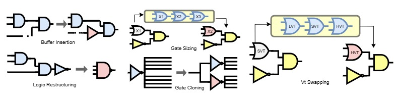

# OpenROAD Python API and Nvidia's CircuitOps example
This directory contains sample Python scripts for using [*OpenROAD Python APIs*](https://github.com/The-OpenROAD-Project/OpenROAD/tree/master) and [*Nvidia's CircuitOps*](https://github.com/NVlabs/CircuitOps/tree/main).

## Nvidia's CircuitOps example
Refer to this link to find [*examples*](https://github.com/NVlabs/CircuitOps/tree/e1c9983ed643cd8d2f2d3172a09fc6a2033a30d0/examples) to see how to use CircuitOps scripts.

## OpenROAD Python API
(Make sure to build OpenROAD locally first or use the provided Dockerfile to build the environment)
### Performing netlist transformations in OpenROAD
 You can make the following transformations.
- logic restructuring
- gate sizing
- gate cloning
- Vt swaps
- buffer insertion/deletion



  
<i> Replace "The name of the benchmark" with the name of the provided benchmark. The default benchmark is <b>ac97_top</b> if the "--d" flag is not added.</i>
```
../../OpenROAD/build/src/openroad -python OpenROAD_example.py --d <The name of the benchmark>
```
For more examples, please find [*ASU-VDA-Lab/ASP-DAC24-Tutorial*](https://github.com/ASU-VDA-Lab/ASP-DAC24-Tutorial/tree/main).


